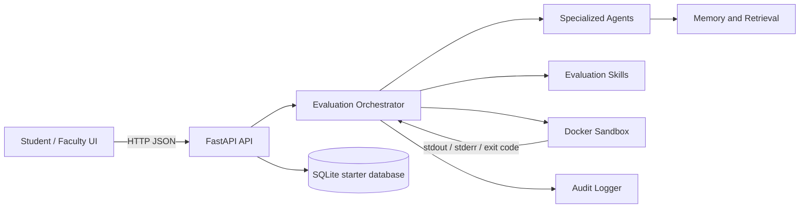

# System Architecture

The frontend sends exam and submission requests to the API. Runtime services coordinate validation, sandbox execution, scoring, and result publication. Each language runner is isolated in a Docker image; the starter setup disables network access and applies resource limits.
